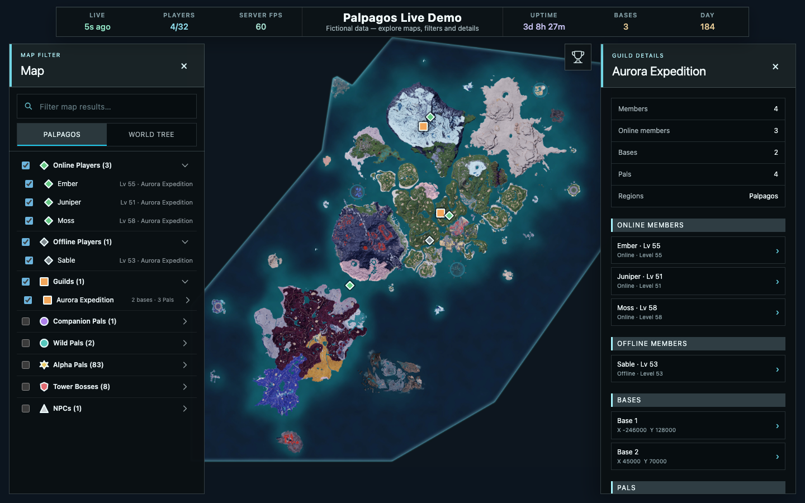

# Palworld Live Map

[](https://github.com/LukeHollandDev/palworld-live-map/actions/workflows/ci.yml)
[](https://github.com/LukeHollandDev/palworld-live-map/pkgs/container/palworld-live-map)
[](LICENSE)

A self-hosted, read-only live map for Palworld dedicated servers. It combines the official REST API, completed native save backups, and versioned game-data landmarks so communities can see online and offline players, guilds, progression, encounters, bases, Pals, NPCs, and server health—with no client mods.


## What Is Palworld Live Map?

Palworld Live Map is a self-hosted website for communities running a Palworld dedicated server. It connects to Palworld's official REST API for live state and can read completed native save backups for the persistent roster, guild membership, levels, capture/Paldeck progress, last-seen times, and last-saved offline positions.

## Features

- Interactive Palpagos and World Tree maps
- Dedicated, extensible leaderboard panel with a full online/offline player-level ranking
- Live online locations and last-saved offline player locations
- Persistent guild rosters, including offline members
- Field Alpha Pal and tower-boss landmarks
- Bases, companion Pals, wild Pals, and NPCs
- Save-backed player details for lifetime Pal captures, unique Pals caught, and Paldeck unlocks
- Map filters for online and offline players, guilds, Pals, NPCs, and encounter landmarks
- Live connection freshness, player capacity, server FPS, uptime, base count, and in-game day
- Configurable polling intervals and world-object layers
- Demo mode with fictional moving players and world objects
- Browser-based interface with no client mods required

## Explore players, guilds, and Pals

Open the funnel button for map search and filters, or the top-right trophy button for the complete player-level leaderboard. Online Players, Offline Players, and Guilds start expanded and visible; the remaining map layers start collapsed and hidden until selected. Search at the top of the filter narrows both its results and the visible map markers; selecting an item enables its layer when necessary, smoothly moves to it, and opens its details. Companion Pals have their own filter category and link back to their owner. Expanding a guild shows its bases and assigned Pals, while selecting the guild opens the complete online/offline roster across all available maps. Green players are online; gray players are offline and use their last-saved location.



## Run with Docker

Enable Palworld's REST API, then start the map with the REST API URL and your server's admin password:

```bash
docker run -d \
  --name palworld-live-map \
  --restart unless-stopped \
  -p 8080:8080 \
  -e PALWORLD_REST_URL="http://your-palworld-server:8212" \
  -e PALWORLD_ADMIN_PASSWORD="your-admin-password" \
  ghcr.io/lukehollanddev/palworld-live-map:latest
```

Replace the URL and password with your server's values, then open <http://localhost:8080>. Enable Palworld's game-data API to also display bases, Pals, and NPCs. A healthcheck endpoint is available at `/-/health`.

The Alpha Pal and tower-boss catalogue is generated by the project exporter from an installed copy of Palworld, then bundled so deployments do not require the game-data endpoint or save access for those static locations. Save-backed rosters are optional because they require a read-only save mount and an operator-provided Oodle runtime. See [Save-backed data](docs/save-data.md) for the secure setup and data-source model.

The bundled Compose file provides the same single-service setup:

```bash
cp .env.example .env
# Edit .env with the server URL and admin password, then:
docker compose up -d
```

For a local preview that does not need a Palworld server or credentials:

```bash
docker run --rm -p 127.0.0.1:8080:8080 -e DEMO_MODE=true \
  ghcr.io/lukehollanddev/palworld-live-map:latest
```

### Run with Palworld Server Docker

If you use [`thijsvanloef/palworld-server-docker`](https://github.com/thijsvanloef/palworld-server-docker), add the map to the same Compose file. Both services use the same `ADMIN_PASSWORD`, and the map connects using the `palworld` service name:

```yaml
services:
  palworld:
    image: thijsvanloef/palworld-server-docker:latest
    environment:
      ADMIN_PASSWORD: "${ADMIN_PASSWORD}"
      REST_API_ENABLED: "true"
      REST_API_PORT: "8212"
      ENABLE_GAMEDATA_API: "true"
    volumes:
      - palworld-data:/palworld

  map:
    image: ghcr.io/lukehollanddev/palworld-live-map:latest
    restart: unless-stopped
    environment:
      PALWORLD_REST_URL: http://palworld:8212
      PALWORLD_ADMIN_PASSWORD: "${ADMIN_PASSWORD}"
      SAVE_DATA_ENABLED: "true"
      PALWORLD_SAVE_ROOT: /data/palworld/Pal/Saved/SaveGames/0
      SAVE_OODLE_LIBRARY: /runtime/liboo2corelinux64.so.9
    ports:
      - "${HTTP_PORT:-8080}:8080"
    volumes:
      - palworld-data:/data/palworld:ro
      - ./private/liboo2corelinux64.so.9:/runtime/liboo2corelinux64.so.9:ro

volumes:
  palworld-data:
```

Set `ADMIN_PASSWORD`, place a legally obtained Linux Oodle runtime at the example private path (or configure the explicit URL and digest mode), then run `docker compose up -d`. When at least two complete native backup generations exist, save support reads the second-newest and leaves the newest alone; with only one complete generation, it reads that generation.

## Configuration

Every supported environment option and timeout is listed below and documented in [`.env.example`](.env.example).

| Variable                  | Purpose                                                           | Default  |
| ------------------------- | ----------------------------------------------------------------- | -------- |
| `PALWORLD_REST_URL`       | Private URL of the official Palworld REST API                     | required |
| `PALWORLD_ADMIN_PASSWORD` | REST admin password; never sent to browsers                       | required |
| `DEMO_MODE`               | Use fictional data and do not contact Palworld                    | `false`  |
| `HTTP_PORT`               | Host port published by Compose                                    | `8080`   |
| `ADDR`                    | Address the Go HTTP server listens on                             | `:8080`  |
| `POLL_INTERVAL`           | Player and metrics refresh interval; minimum `2s`                 | `5s`     |
| `UPSTREAM_TIMEOUT`        | Player and server-information timeout; must be below `POLL_INTERVAL` | `4s`  |
| `WORLD_DATA_ENABLED`      | Poll bases, Pals, and NPCs                                        | `true`   |
| `WORLD_POLL_INTERVAL`     | World-object refresh interval; minimum `5s`                       | `15s`    |
| `WORLD_TIMEOUT`           | World-object timeout; must be below `WORLD_POLL_INTERVAL`         | `10s`    |
| `SAVE_DATA_ENABLED`       | Read persistent roster/guild data from completed save backups     | `false`  |
| `PALWORLD_SAVE_ROOT`      | Read-only `SaveGames/0` directory inside the container            | `/data/palworld/saves` |
| `PALWORLD_SAVE_WORLD_ID`  | 32-hex world directory; auto-selected when there is only one       | empty    |
| `SAVE_POLL_INTERVAL`      | Save-roster refresh interval; minimum `15s`                       | `30s`    |
| `SAVE_TIMEOUT`            | Per-snapshot read timeout; must be below `SAVE_POLL_INTERVAL`      | `20s`    |
| `SAVE_OODLE_LIBRARY`      | Absolute path to an operator-provided Oodle shared library        | empty    |
| `SAVE_OODLE_DOWNLOAD_URL` | Explicit operator-selected HTTPS library URL                      | empty    |
| `SAVE_OODLE_SHA256`       | Required SHA-256 when download mode is selected                   | empty    |
| `SAVE_OODLE_CACHE_DIR`    | Writable cache for a verified downloaded runtime                  | `/tmp/palworld-live-map/oodle` |

When save data is enabled, configure exactly one Oodle source: `SAVE_OODLE_LIBRARY`, or the URL and SHA-256 pair. The application does not ship or select a proprietary binary for you.

## License

[MIT](LICENSE)

The save reader retains its [Apache-2.0 license](internal/savegame/LICENSE), [attribution notice](internal/savegame/NOTICE), and [Oodle-loader notice](internal/savegame/THIRD_PARTY_NOTICES.md). The encounter catalogue's first-party extraction sources and reproducible workflow are documented alongside the [generated manifest](assets/landmarks/README.md). Corresponding third-party license texts are included under `/licenses` in the container image.

Palworld Live Map is an independent, fan-made project. It is not affiliated with, endorsed by, or sponsored by Pocketpair, Inc. Palworld and related names and marks belong to their respective owners.
