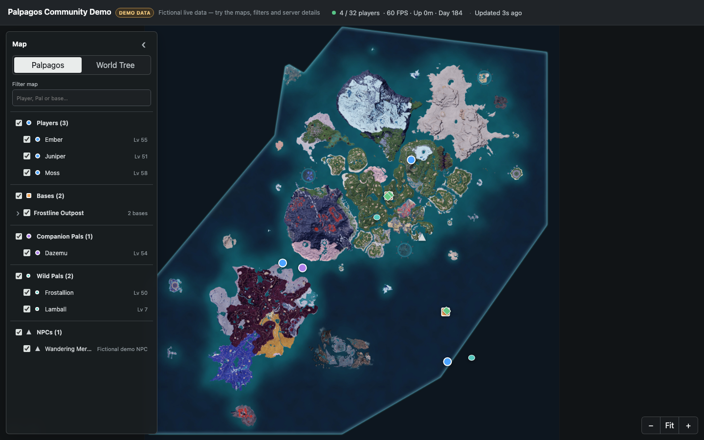

# Palworld Live Map

[](https://github.com/LukeHollandDev/palworld-live-map/actions/workflows/ci.yml)
[](https://github.com/LukeHollandDev/palworld-live-map/pkgs/container/palworld-live-map)
[](LICENSE)

A self-hosted, read-only live map for Palworld dedicated servers. Players can see who is online and where they are across Palpagos and World Tree, with live bases, Pals, NPCs, and server health—all in a browser with no client mods.



**[Try demo mode](#try-it-without-a-palworld-server)** · **[Add a map to an existing server](#existing-palworld-server)** · **[Host a new server and map together](#new-palworld-server--live-map)**

## Why this project

- **Player-facing, not an admin panel:** safe, focused visibility without kick, ban, save-editing, or server-control features.
- **No client mods:** every player uses an ordinary browser.
- **Credentials stay server-side:** browsers never receive the REST admin password, player IDs, account IDs, or IP addresses.
- **One shared poller:** browser count does not multiply traffic to the game server.
- **Self-contained container:** the web app and native 8K Palpagos and World Tree artwork ship in one multi-architecture image.

## Try it without a Palworld server

Demo mode generates fictional moving players and world objects while exercising the production poller, API, and frontend:

```bash
docker run --rm -p 8080:8080 -e DEMO_MODE=true \
  ghcr.io/lukehollanddev/palworld-live-map:latest
```

Open <http://localhost:8080>.

## Install

### Existing Palworld server

Enable the official REST API. Enable the game-data API as well for bases, Pals, and NPCs. For `thijsvanloef/palworld-server-docker`:

```yaml
environment:
  REST_API_ENABLED: "true"
  REST_API_PORT: "8212"
  ENABLE_GAMEDATA_API: "true"
```

Then download and start the map:

```bash
mkdir palworld-live-map && cd palworld-live-map
curl -fsSLO https://raw.githubusercontent.com/LukeHollandDev/palworld-live-map/main/compose.yml
curl -fsSL https://raw.githubusercontent.com/LukeHollandDev/palworld-live-map/main/.env.example -o .env
# Edit .env with the REST URL and admin password.
docker compose up -d
```

Open `http://localhost:8080`, or the host port selected with `HTTP_PORT`.

### New Palworld server + live map

The full-stack Compose project starts [thijsvanloef/palworld-server-docker](https://github.com/thijsvanloef/palworld-server-docker) and this map on one private network. The REST API is reachable by the map but is not published to the host.

```bash
mkdir palworld-with-map && cd palworld-with-map
curl -fsSL https://raw.githubusercontent.com/LukeHollandDev/palworld-live-map/main/deploy/full-stack/compose.yml -o compose.yml
curl -fsSL https://raw.githubusercontent.com/LukeHollandDev/palworld-live-map/main/deploy/full-stack/.env.example -o .env
# Replace both passwords and review the settings in .env.
docker compose up -d
docker compose logs -f palworld
```

The first server start downloads Palworld and can take several minutes. See the [full-stack operating guide](deploy/full-stack/README.md) for upgrades, backups, port forwarding, and password rotation.

## Configuration

Most existing-server installations need only:

| Variable | Purpose | Default |
| --- | --- | --- |
| `PALWORLD_REST_URL` | Private URL of the official Palworld REST API | required |
| `PALWORLD_ADMIN_PASSWORD` | REST admin password; never sent to browsers | required |
| `DEMO_MODE` | Use fictional data and do not contact Palworld | `false` |
| `HTTP_PORT` | Host port used by Compose | `8080` |
| `POLL_INTERVAL` | Player and metrics refresh interval | `5s` |
| `WORLD_DATA_ENABLED` | Poll bases, Pals, and NPCs | `true` |
| `WORLD_POLL_INTERVAL` | World-object refresh interval | `15s` |

Every option and timeout is documented in [`.env.example`](.env.example).

## Compatibility and limitations

| Component | Supported |
| --- | --- |
| Palworld | 1.0 official dedicated-server REST API |
| Architectures | Linux amd64 and arm64 |
| Browsers | Current Chrome, Firefox, Safari, and Edge |
| Thijs server image | Current `latest`; game-data layers require `ENABLE_GAMEDATA_API` support |

The game-data endpoint reports loaded characters and Palboxes. It does not expose every wall, chest, crafting station, or other building part. Supporting those would require a separate save-file parser.

The map has no built-in viewer authentication. Put it behind an HTTPS reverse proxy and access control if player positions should not be public. Never expose Palworld REST port `8212` to the internet.

## Documentation

- [Troubleshooting](docs/TROUBLESHOOTING.md)
- [Development and architecture](DEVELOPMENT.md)
- [Map generation and provenance](assets/map/README.md)
- [Hosted demo options](docs/HOSTED_DEMO.md)
- [Contributing](CONTRIBUTING.md)
- [Security policy](SECURITY.md)

## Unofficial project and artwork

This project is not affiliated with or endorsed by Pocketpair, Palworld Entertainment, or TH.GL. Palworld names, trademarks, and bundled map artwork belong to their respective owners. The MIT licence covers this project's original code and documentation, not Palworld artwork. See the [map notice and removal process](assets/map/README.md).

## License

[MIT](LICENSE)
