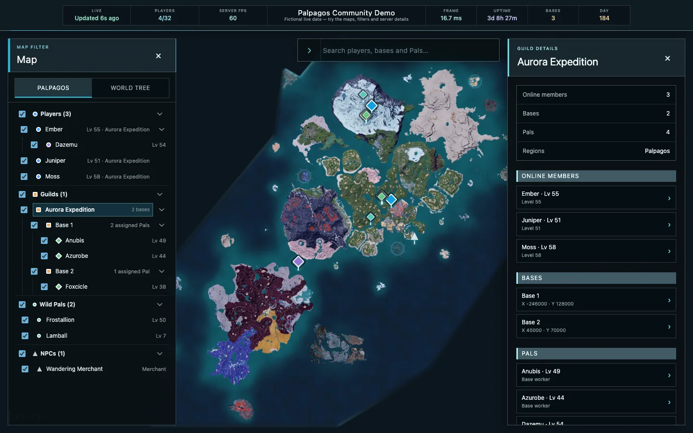

# Palworld Live Map

[](https://github.com/LukeHollandDev/palworld-live-map/actions/workflows/ci.yml)
[](https://github.com/LukeHollandDev/palworld-live-map/pkgs/container/palworld-live-map)
[](LICENSE)

A self-hosted, read-only live map for Palworld dedicated servers. Players can see who is online and where they are across Palpagos and World Tree, with live bases, Pals, NPCs, and server health—all in a browser with no client mods.


## What Is Palworld Live Map?

Palworld Live Map is a self-hosted website for communities running a Palworld dedicated server. It connects to Palworld's official REST API and displays the current server state on interactive Palpagos and World Tree maps, including online players, bases, Pals, NPCs, and server health.

## Features

- Interactive Palpagos and World Tree maps
- Live player locations and online-player list
- Bases, companion Pals, wild Pals, and NPCs
- Hierarchical filters: players → companion Pals and guilds → bases → assigned Pals
- Live connection freshness, player capacity, server FPS, frame time, uptime, base count, and in-game day
- Configurable polling intervals and world-object layers
- Demo mode with fictional moving players and world objects
- Browser-based interface with no client mods required

## Explore guilds and companion Pals

Expand an online player to see their travelling companion Pals, or expand a guild to inspect its bases and assigned Pals. Selecting a guild opens a combined view of its currently visible members, bases, and Pals across the available maps.



## Run with Docker

Enable Palworld's REST API, then start the map with the REST API URL and your server's admin password:

```bash
docker run -d \
  --name palworld-live-map \
  --restart unless-stopped \
  -p 8080:8080 \
  -e PALWORLD_REST_URL="http://your-palworld-server:8212" \
  -e PALWORLD_ADMIN_PASSWORD="your-admin-password" \
  ghcr.io/lukehollanddev/palworld-live-map:latest
```

Replace the URL and password with your server's values, then open <http://localhost:8080>. Enable Palworld's game-data API to also display bases, Pals, and NPCs.

The bundled Compose file provides the same single-service setup:

```bash
cp .env.example .env
# Edit .env with the server URL and admin password, then:
docker compose up -d
```

For a local preview that does not need a Palworld server or credentials:

```bash
docker run --rm -p 127.0.0.1:8080:8080 -e DEMO_MODE=true \
  ghcr.io/lukehollanddev/palworld-live-map:latest
```

### Connect through an SSH tunnel

Keep the Palworld REST API private. If it is only reachable from a remote host, forward it to loopback instead of publishing port 8212:

```bash
ssh -N -L 127.0.0.1:8212:127.0.0.1:8212 user@palworld-host
```

The final host and port are resolved from `palworld-host`, so replace them if that machine reaches the REST API at another address. Keep the tunnel running, then use `PALWORLD_REST_URL=http://127.0.0.1:8212` with the [source run](DEVELOPMENT.md#run-from-source). Docker Desktop can normally reach the tunnel through `host.docker.internal`; native Linux containers cannot reach a host service bound only to loopback, so use the source run or put the tunnel in a private container network rather than exposing it on `0.0.0.0`.

### Run with Palworld Server Docker

If you use [`thijsvanloef/palworld-server-docker`](https://github.com/thijsvanloef/palworld-server-docker), add the map to the same Compose file. Both services use the same `ADMIN_PASSWORD`, and the map connects using the `palworld` service name:

```yaml
services:
  palworld:
    image: thijsvanloef/palworld-server-docker:latest
    environment:
      ADMIN_PASSWORD: "${ADMIN_PASSWORD}"
      REST_API_ENABLED: "true"
      REST_API_PORT: "8212"
      ENABLE_GAMEDATA_API: "true"

  map:
    image: ghcr.io/lukehollanddev/palworld-live-map:latest
    restart: unless-stopped
    environment:
      PALWORLD_REST_URL: http://palworld:8212
      PALWORLD_ADMIN_PASSWORD: "${ADMIN_PASSWORD}"
    ports:
      - "${HTTP_PORT:-8080}:8080"
```

Set `ADMIN_PASSWORD` in the project's `.env`, then run `docker compose up -d`.

## Configuration

Most installations only need these settings:

| Variable                  | Purpose                                        | Default  |
| ------------------------- | ---------------------------------------------- | -------- |
| `PALWORLD_REST_URL`       | Private URL of the official Palworld REST API  | required |
| `PALWORLD_ADMIN_PASSWORD` | REST admin password; never sent to browsers    | required |
| `DEMO_MODE`               | Use fictional data and do not contact Palworld | `false`  |
| `HTTP_PORT`               | Host port used by Compose                      | `8080`   |
| `POLL_INTERVAL`           | Player and metrics refresh interval            | `5s`     |
| `WORLD_DATA_ENABLED`      | Poll bases, Pals, and NPCs                     | `true`   |
| `WORLD_POLL_INTERVAL`     | World-object refresh interval                  | `15s`    |

Every environment option and timeout is documented in [`.env.example`](.env.example).

## Live-data scope

The Explorer groups companion Pals under their matching online player and groups Palbox bases under their guild, with assigned base Pals nested below each base. Explicit fallback groups keep companion Pals with no currently online owner or with an owner on another map, and base Pals that cannot be linked to a reported base, visible rather than silently dropping them.

Base membership is a conservative live-data projection because the REST response does not include an exact worker-container link or a configured base radius. A `BaseCampPal` is assigned only to a base in the same guild and map when it is within the standard 3,500-unit Palbox radius plus 2.5% tolerance; the nearest base wins when perimeters overlap. Travelling companion Pals and wild Pals are never assigned by proximity.

The REST-only application cannot show offline guild rosters, stored Pals, exact Pal containers, or modded base radii. Save-data reading is not currently implemented; the privacy and isolation requirements for an optional future integration are documented in [DEVELOPMENT.md](DEVELOPMENT.md#optional-save-data-direction).

## License

[MIT](LICENSE)
