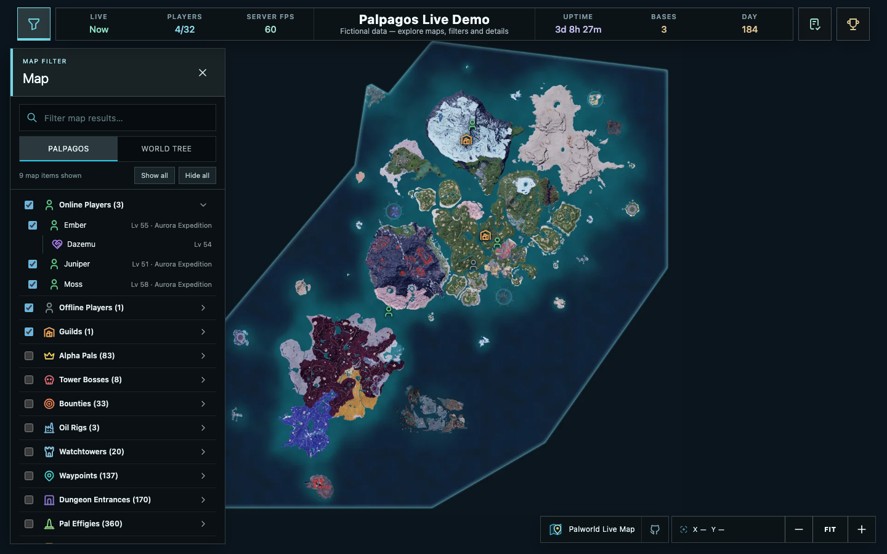
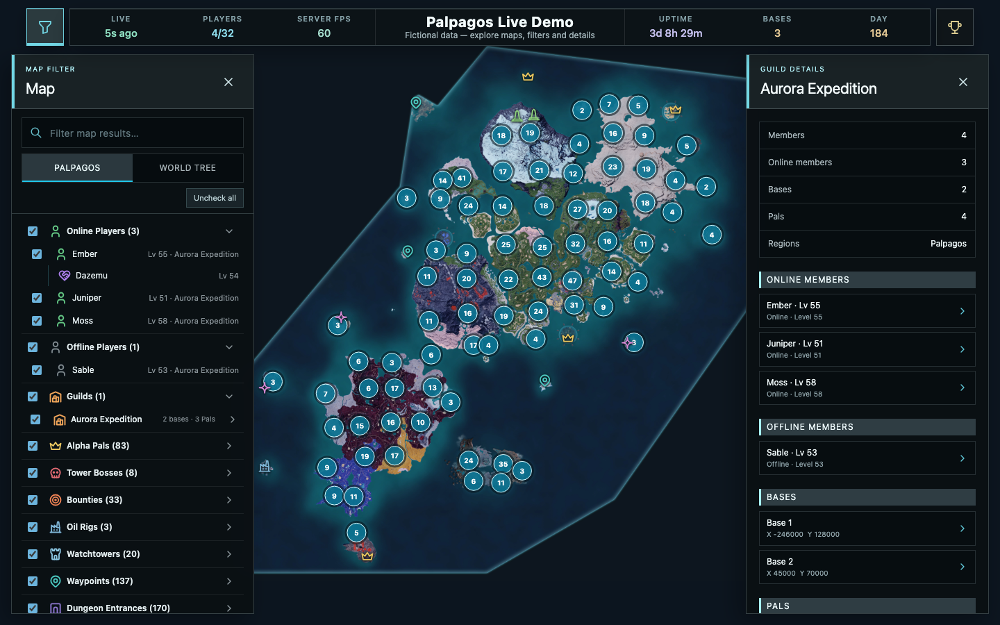

# Palworld Live Map

[](https://github.com/LukeHollandDev/palworld-live-map/actions/workflows/ci.yml)
[](https://github.com/LukeHollandDev/palworld-live-map/pkgs/container/palworld-live-map)
[](LICENSE)

Give your Palworld community a live view of players, guilds, bases, Pals, in-game locations, and server health. It runs against your dedicated server's official APIs, stays read-only, and needs no client mods.



## Features

- Interactive maps of Palpagos and the World Tree
- Live player locations and a player-level leaderboard
- Guild bases, members, and assigned worker Pals
- Current companion Pals linked to their players
- Search and filters for players, guilds, Pals, bases, and in-game locations
- Live player count, server FPS, uptime, base count, in-game day, and connection status
- Optional save integration adds offline players, saved locations, levels,
  guilds, capture totals, Paldeck progress, and last-seen times
- Configurable refresh intervals and world-object layers
- Demo mode with fictional moving players and world objects

## Find anything on the map

Open the map filter to choose which markers are shown and search for players, guilds, Pals, bases, or in-game landmarks. Select a result to jump to its location and open its details.



## Run with Docker

Enable Palworld's REST API, then start the map with the REST API URL and your server's admin password:

```bash
docker run -d \
  --name palworld-live-map \
  --restart unless-stopped \
  -p 8080:8080 \
  -e PALWORLD_REST_URL="http://your-palworld-server:8212" \
  -e PALWORLD_ADMIN_PASSWORD="your-admin-password" \
  ghcr.io/lukehollanddev/palworld-live-map:latest
```

Replace the URL and password with your server's values, then open <http://localhost:8080>. Enable Palworld's game-data API to also display bases, Pals, and NPCs. A healthcheck endpoint is available at `/-/health`.

To enable save enrichment, add `-v /path/to/Pal/Saved/SaveGames/0:/data/palworld/saves:ro`
and `-e SAVE_DATA_ENABLED=true`. The save directory must be mounted read-only.

In-game locations are bundled with the map, so they remain available without the game-data API.

The bundled Compose file provides the same single-service setup:

```bash
cp .env.example .env
# Edit .env with the server URL and admin password, then:
docker compose up -d
```

For a local preview that does not need a Palworld server or credentials:

```bash
docker run --rm -p 127.0.0.1:8080:8080 -e DEMO_MODE=true \
  ghcr.io/lukehollanddev/palworld-live-map:latest
```

Docker is the supported deployment method. See [Development](DEVELOPMENT.md#run-from-source) to run from source.

## Run with Palworld Server Docker

If you run your server with [`thijsvanloef/palworld-server-docker`](https://github.com/thijsvanloef/palworld-server-docker), add the map to the same Compose file, set `ADMIN_PASSWORD`, then start both services with `docker compose up -d`. The map connects through the `palworld` service name:

```yaml
services:
  palworld:
    image: thijsvanloef/palworld-server-docker:latest
    environment:
      ADMIN_PASSWORD: "${ADMIN_PASSWORD}"
      REST_API_ENABLED: "true"
      REST_API_PORT: "8212"
      ENABLE_GAMEDATA_API: "true"
    volumes:
      - palworld-data:/palworld

  map:
    image: ghcr.io/lukehollanddev/palworld-live-map:latest
    restart: unless-stopped
    environment:
      PALWORLD_REST_URL: http://palworld:8212
      PALWORLD_ADMIN_PASSWORD: "${ADMIN_PASSWORD}"
      SAVE_DATA_ENABLED: "true"
      PALWORLD_SAVE_ROOT: /palworld-data/Pal/Saved/SaveGames/0
    ports:
      - "${HTTP_PORT:-8080}:8080"
    volumes:
      - palworld-data:/palworld-data:ro

volumes:
  palworld-data:
```

## Configuration

Every supported environment option and timeout is listed below and documented in [`.env.example`](.env.example).

| Variable                  | Purpose                                                              | Default                |
| ------------------------- | -------------------------------------------------------------------- | ---------------------- |
| `PALWORLD_REST_URL`       | Private URL of the official Palworld REST API                        | required               |
| `PALWORLD_ADMIN_PASSWORD` | REST admin password; never sent to browsers                          | required               |
| `DEMO_MODE`               | Use fictional data and do not contact Palworld                       | `false`                |
| `HTTP_PORT`               | Host port published by Compose                                       | `8080`                 |
| `ADDR`                    | Address the Go HTTP server listens on                                | `:8080`                |
| `POLL_INTERVAL`           | Player and metrics refresh interval; minimum `2s`                    | `5s`                   |
| `UPSTREAM_TIMEOUT`        | Player and server-information timeout; must be below `POLL_INTERVAL` | `4s`                   |
| `WORLD_DATA_ENABLED`      | Poll bases, Pals, and NPCs                                           | `true`                 |
| `WORLD_POLL_INTERVAL`     | World-object refresh interval; minimum `5s`                          | `15s`                  |
| `WORLD_TIMEOUT`           | World-object timeout; must be below `WORLD_POLL_INTERVAL`            | `10s`                  |
| `SAVE_DATA_ENABLED`       | Enrich REST-visible players from immutable save backups              | `false`                |
| `PALWORLD_SAVE_ROOT`      | Read-only `SaveGames/0` directory                                    | `/data/palworld/saves` |
| `PALWORLD_SAVE_WORLD_ID`  | Exact world ID when automatic discovery is ambiguous                 | empty                  |
| `SAVE_POLL_INTERVAL`      | Save enrichment interval; minimum `15s`                              | `30s`                  |
| `SAVE_TIMEOUT`            | Whole-generation timeout; must be below `SAVE_POLL_INTERVAL`         | `20s`                  |

To enable save integration, mount the server's `SaveGames/0` directory read-only
and set `SAVE_DATA_ENABLED=true`. The image includes the pinned
[`palworld-save-reader`](https://github.com/LukeHollandDev/palworld-save-reader)
automatically. Save records add offline players and progression without exposing
raw account, player, or guild identifiers.

Save decoding can use substantial memory, so leave container headroom. A
decoding problem does not interrupt the live map: online players and available
progress remain visible, while the map reports that offline details are
temporarily unavailable.

## License

The Go application, web application, documentation, and other original project files are [MIT](LICENSE) unless marked otherwise. Palworld-derived map textures, screenshots, and extracted game data remain copyright Pocketpair; see the [Palworld asset provenance](assets/palworld/README.md) for extraction sources and the reproducible workflow. Inclusion in the same repository or container does not replace a component's own terms.

Palworld Live Map is an independent, fan-made project. It is not affiliated with, endorsed by, or sponsored by Pocketpair, Inc. Palworld and related names and marks belong to their respective owners.
